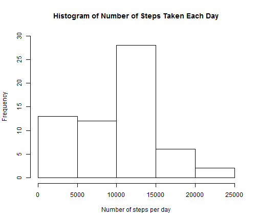
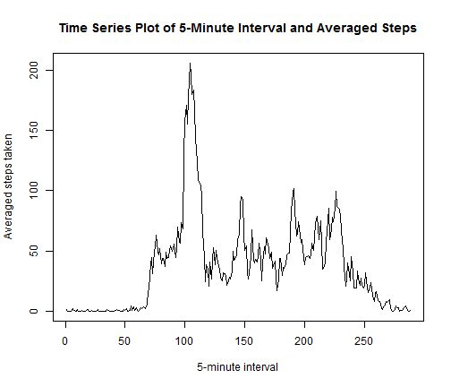
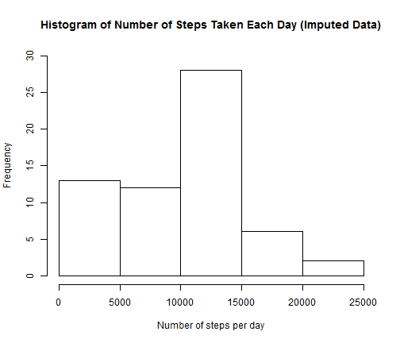
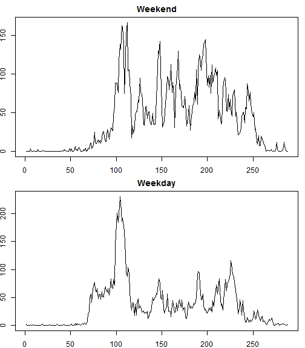

# Reproducible Research: Peer Assessment 1

## Loading and preprocessing the data
The first step is to load the data.

```r
rawdata <- read.csv("activity.csv")
```


## What is mean total number of steps taken per day?
Calculate the total number of steps taken each day, ignoring the missing values.


```r
completedata <- na.omit(rawdata)
splitdata <- split(completedata, completedata$date)
colsum <- sapply(splitdata, function(x) sum(x[, 1]))
colsum2 <- data.frame(date = names(colsum), steps = colsum)
```


Below is the histogram of the total number of steps taken each day.

```r
hist(colsum2[, 2], xlab = "Number of steps per day", main = "Histogram of Number of Steps Taken Each Day", 
    ylim = c(0, 30))
```

 


```r
mean <- round(mean(colsum2[, 2]), 0)
median <- round(median(colsum2[, 2]), 0)
```

The mean and median for the total number of steps taken per day are 9354 and 1.0395 &times; 10<sup>4</sup>.

## What is the average daily activity pattern?
Below is the time series plot of the 5-minute interval(x-axis) and the average number of steps taken, averaged across all days (y-axis).

```r
splitdata2 <- split(completedata, completedata$interval)
colmean <- sapply(splitdata2, function(x) mean(x[, 1]))
colmean2 <- data.frame(interval = names(colmean), avesteps = colmean)
plot(colmean2[, 2], type = "l", xlab = "5-minute interval", ylab = "Averaged steps taken", 
    main = "Time Series Plot of 5-Minute Interval and Averaged Steps")
```

 


## Imputing missing values

```r
nmissing <- nrow(rawdata[rawdata$steps == NA, ])
```

There are 17568 missing values in this dataset. Assign the mean of that interval's steps to those missing values. Below is the histogram for the imputed data.


```r
total <- merge(rawdata, colmean2, by = "interval", all = TRUE)
total$finalsteps <- ifelse(is.na(total$steps), total$avesteps, total$steps)
splitdata3 <- split(total, total$date)
colsumfinal <- sapply(splitdata3, function(x) sum(x$finalsteps))
colsumfinal2 <- data.frame(date = names(colsum), steps = colsum)
hist(colsumfinal2[, -1], xlab = "Number of steps per day", main = "Histogram of Number of Steps Taken Each Day (Imputed Data)", 
    ylim = c(0, 30))
```

 


```r
mean1 <- round(mean(colsumfinal2[, -1]), 0)
median1 <- round(median(colsumfinal2[, -1]), 0)
```

The mean and median for the total number of steps taken per day are 9354 and 1.0395 &times; 10<sup>4</sup>. These values don't differ from what were obtained from the complete dataset. The imputation by assigning the mean of that interval to the missing values does not impact the estimation of the total number of steps taken per day.


## Are there differences in activity patterns between weekdays and weekends?
Use data with filled in missing values for this exercise.

```r
total$day <- weekdays(as.Date(total$date))
total$week <- ifelse(total$day %in% c("Saturday", "Sunday"), c("weekend"), c("weekday"))
splitdata4 <- split(total, list(total$week, total$interval))
splitdata4 <- split(total, total[, c("week", "interval")])
colmeanfinal <- sapply(splitdata4, function(x) mean(x$finalsteps))
colmeanfinal2 <- data.frame(weekinterval = names(colmeanfinal), steps = colmeanfinal)
colmeanfinal2$week <- substr(colmeanfinal2$weekinterval, 1, 7)
colmeanfinal2$interval <- substr(colmeanfinal2$weekinterval, 9, 12)
```


The following panel plot is created for weekends and weekdays.

```r
par(mfrow = c(2, 1), mar = c(2, 1.8, 2, 0.8))
# par(fig=c(0,0.8,0,0.8), new=TRUE)
plot(colmeanfinal2[colmeanfinal2$week == "weekend", 2], type = "l", main = "Weekend")
plot(colmeanfinal2[colmeanfinal2$week == "weekday", 2], type = "l", main = "Weekday")
```

 

It looks there's a difference in acitivity patterns between weekends and weekdays.

